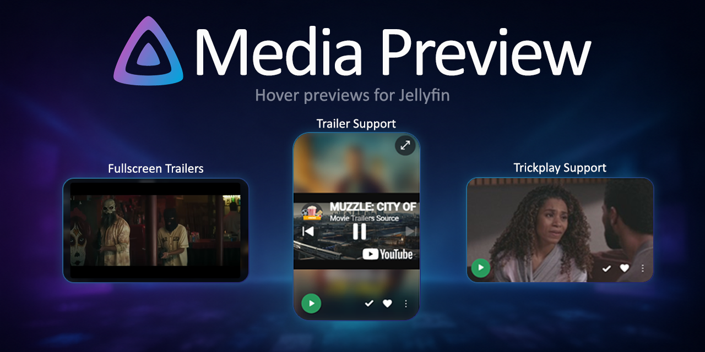

# Jellyfin Media Preview



`Jellyfin Media Preview` adds hover previews to Jellyfin Web.

Hover a movie, series, or episode card and the plugin can show a quick preview using Jellyfin Trickplay thumbnails, local trailers, or YouTube trailers already known to Jellyfin.

## Features

- Hover previews on supported Jellyfin Web cards
- Trickplay thumbnail previews
- Local trailer and YouTube trailer previews
- Source priority settings, including Trickplay-first or trailer-first fallback
- Optional trailer audio after browser interaction
- Lightweight visual options for poster backdrops

## Requirements

- Jellyfin with the web interface
- The [File Transformation](https://www.iamparadox.dev/jellyfin/plugins/manifest.json) plugin
- Trickplay data, trailer metadata, or both for the items you want to preview

Media Preview does not generate Trickplay data or fetch trailer metadata. It uses preview data that Jellyfin already has.

## Installation

Install both plugins:

1. `Media Preview`
2. `File Transformation`

### Media Preview

1. Open `Dashboard -> Catalog -> Settings` in Jellyfin.
2. Add this plugin repository:

   ```text
   https://raw.githubusercontent.com/spkesDE/jellyfin-media-preview-plugin/main/manifest.json
   ```

3. Save, open the plugin catalog, and install `Media Preview`.
4. Restart Jellyfin.

### File Transformation

1. Add the File Transformation repository:

   ```text
   https://www.iamparadox.dev/jellyfin/plugins/manifest.json
   ```

2. Install `File Transformation`.
3. Restart Jellyfin.

Without File Transformation, Media Preview cannot load inside Jellyfin Web.

## Setup

1. Open the Jellyfin admin dashboard.
2. Open the `Media Preview` plugin settings.
3. Choose a preview source mode.
4. Save.
5. Refresh Jellyfin Web.

For most libraries, `Prefer Trickplay` is a good starting point. If your library has better trailer metadata than Trickplay coverage, try `Prefer Trailers`.

## Preview Sources

| Source | Best for |
|---|---|
| Trickplay | Lightweight previews from Jellyfin thumbnail sheets |
| Local trailers | Video previews served by your Jellyfin server |
| YouTube trailers | Trailer previews when Jellyfin already has YouTube trailer metadata |

If no supported preview source is available for an item, the card stays unchanged.

## Troubleshooting

If previews do not show up:

1. Make sure both `Media Preview` and `File Transformation` are installed and enabled.
2. Restart Jellyfin after installing or updating plugins.
3. Hard-refresh Jellyfin Web in your browser.
4. Check whether the item has Trickplay or trailer data.
5. Try another preview source mode.

Trailer audio may stay muted until you interact with the page. This is normal browser autoplay behavior.

YouTube trailers may also be blocked by privacy tools, ad blockers, browser settings, or non-embeddable trailer videos.

## Documentation

- [Build guide](./BUILD.md)
- [Contributing](./CONTRIBUTING.md)
- [AI assistance disclosure](./AI_USAGE.md)
- [Changelog](./CHANGELOG.md)

## License

This project is licensed under the [MIT License](./LICENSE).
