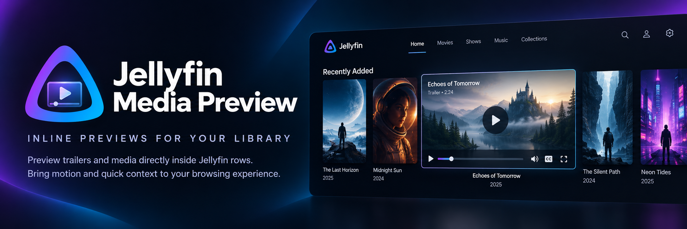

# Jellyfin Media Preview



<p align="center">
  <a href="./LICENSE"></a>
  <a href="https://github.com/spkesDE/jellyfin-media-preview-plugin/releases/latest"></a>
  
  
</p>

Jellyfin Media Preview adds previews directly to cards in Jellyfin Web.

## Features

- Scrub through Trickplay images with the pointer or play them automatically.
- Preview local trailers, supported online and YouTube trailers, or the media item itself.
- Choose different preview sources for libraries, movies, series, episodes, and other videos.
- Set the fallback order when the preferred preview is unavailable.
- Adjust hover behavior, card layout, backdrops, metadata, and playback controls.
- Use experimental keyboard and remote navigation on supported web-based clients.

> [!NOTE]
> Previews only appear in Jellyfin Web and clients that use the Jellyfin Web interface. Native apps with their own library screens cannot show them.

## Installation

1. In Jellyfin, open `Dashboard -> Catalog -> Settings`.
2. Add this plugin repository:

   ```text
   https://raw.githubusercontent.com/spkesDE/jellyfin-media-preview-plugin/main/manifest.json
   ```

3. Install **Media Preview** from the plugin catalog.
4. Restart Jellyfin.

> [!IMPORTANT]
> [File Transformation](https://github.com/IAmParadox27/jellyfin-plugin-file-transformation) or [JavaScript Injector](https://github.com/n00bcodr/Jellyfin-JavaScript-Injector) is recommended for frontend loading. Without a helper, Media Preview can inject its loader directly when `jellyfin-web/index.html` is writable.

### Frontend helper repositories

**File Transformation:**

```text
https://www.iamparadox.dev/jellyfin/plugins/manifest.json
```

**JavaScript Injector:**

```text
https://raw.githubusercontent.com/n00bcodr/jellyfin-plugins/main/manifest.json
```

### Frontend injection

The default `Automatic` mode checks which helpers are installed, enabled, supported, and ready before selecting a method:

1. **File Transformation**
2. **JavaScript Injector**
3. **Direct injection** into `jellyfin-web/index.html`

If one method cannot register, Automatic continues with the next available method. The explicit choices under `Advanced -> Frontend Injection Method` are disabled and marked unavailable when their helper or required file access is missing.

Direct injection is idempotent: Media Preview replaces an existing Media Preview loader instead of adding duplicates. When a helper takes over successfully, the directly injected loader is removed from `index.html`.

> [!TIP]
> Keep the injection method set to `Automatic` unless you need to force a specific available integration.

> [!WARNING]
> Direct injection requires write access to `jellyfin-web/index.html`. Jellyfin updates replace this file, so Media Preview adds its loader again on the next server start.

## Setup

1. Open `Dashboard -> Plugins -> Media Preview`.
2. Choose the preview source you want to use.
3. Adjust hover behavior and appearance if needed.
4. Save, then refresh Jellyfin Web.

> [!NOTE]
> The default source is Trickplay. Media Preview uses existing Trickplay and trailer data; it does not generate images or find new trailers.

## Preview sources

**Trickplay** uses Jellyfin's thumbnail sheets. Move across the card to scrub through the title, or enable automatic motion.

**Trailers** can use local files or supported remote and YouTube links already known to Jellyfin. Trailer audio is optional and may stay muted until the browser has received user input.

**Direct Play** previews the media item itself. The start point, speed, duration, and optional transcode fallback can be changed in the plugin settings.

> [!TIP]
> Use a `Prefer` mode to try other sources when the first choice is unavailable. Fallback sources can be reordered or disabled under `Advanced`.

> [!WARNING]
> Some YouTube videos block embedded playback because they are private, removed, restricted, or not allowed to play outside YouTube.

## Troubleshooting

If previews do not appear:

1. Confirm that Media Preview is enabled. If direct injection is unavailable, install and enable a frontend helper.
2. Restart Jellyfin, then hard-refresh the browser.
3. Check that the title has data for the selected preview source.
4. Try a `Prefer` mode to allow another source as a fallback.
5. Keep the injection method on `Automatic`.
6. Open `Advanced -> Frontend Injection Method` and check which explicit methods are available.
7. For direct injection, confirm that the Jellyfin service account can write to `jellyfin-web/index.html`.
8. Turn on debug logging under `Advanced` and check the browser console and Jellyfin server log.

If it works in a browser but not in a TV app, that app probably uses its own library interface.

> [!TIP]
> When reporting a problem, include the Jellyfin version, plugin version, selected injection method, preview source, and relevant browser or server log lines.

## More information

> [!TIP]
> Like Jellyfin Media Preview? Check out my other plugin: [**Jellyfin Featured**](https://github.com/spkesDE/jellyfin-featured-plugin).

- [Changelog](./CHANGELOG.md)
- [Contributing](./CONTRIBUTING.md)

## License

Licensed under the [MIT License](./LICENSE).
